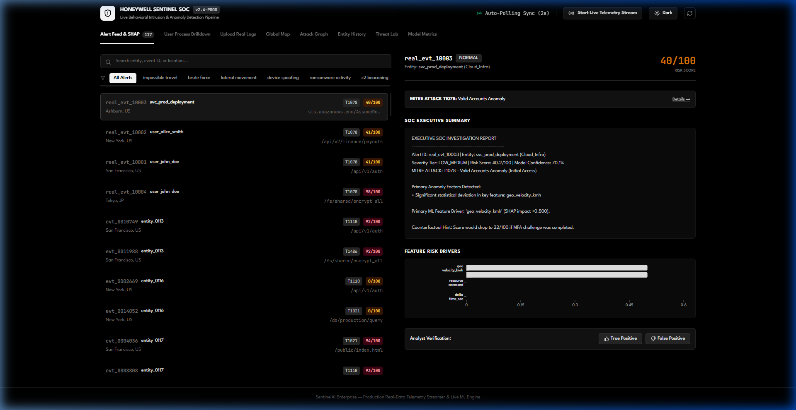
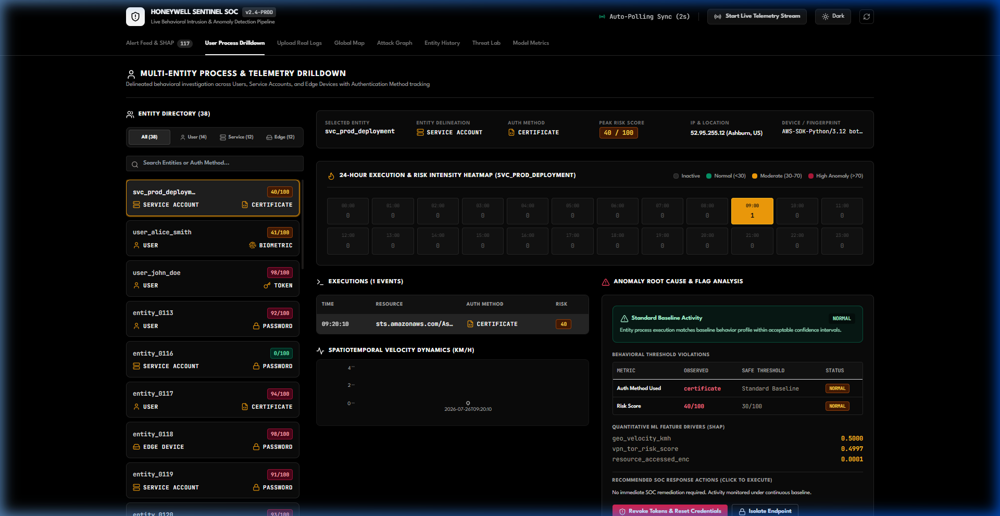
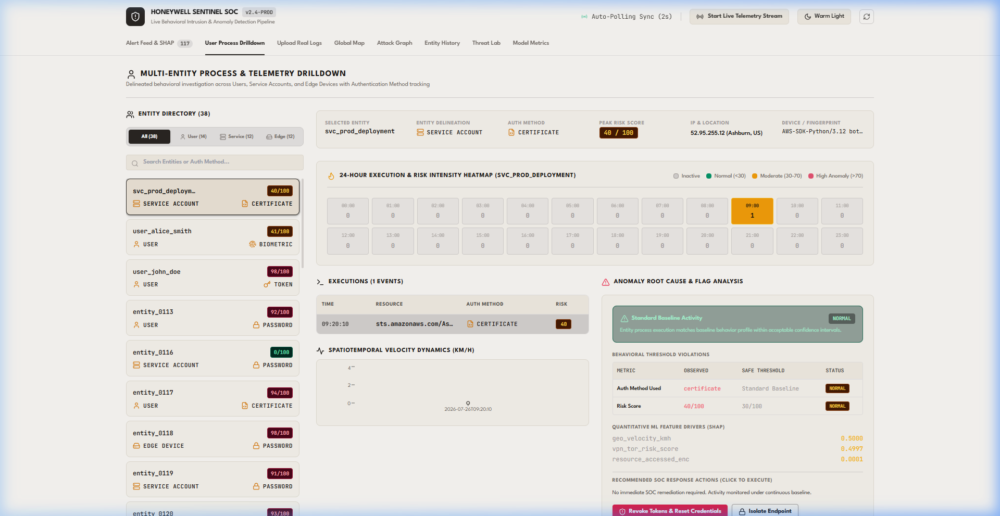

# AI-Powered Behavioral Anomaly Detection for Cybersecurity

## Executive Summary & System Architecture

This solution provides a dynamic, sequence-aware **Behavioral Anomaly Detection System** that analyzes enterprise access logs as continuous sequence events to detect zero-day lateral movement, stolen credential abuse, brute force attacks, and stealthy exfiltration using a **Cascaded LightGBM Detection Engine**.

```
                                  +---------------------------------------+
                                  |   Synthetic Data Generator Engine     |
                                  | - Normal Habitual Baseline            |
                                  | - 7 Injected Attack Patterns          |
                                  | - Noise & Insider Drift Simulation    |
                                  +-------------------+-------------------+
                                                      |
                                                      v
                                  +---------------------------------------+
                                  |    Streaming Feature Processing       |
                                  | - Temporal Cyclical Sin/Cos           |
                                  | - Geo-Haversine & Velocity (km/h)     |
                                  | - Command Sequence N-Gram Embeddings  |
                                  | - Device Fingerprint Hash Drift       |
                                  +-------------------+-------------------+
                                                      |
                                                      v
                                  +---------------------------------------+
                                  |     Cascaded Detection Pipeline       |
                                  | Stage 1: Autoencoder Baseline Profile |
                                  | Stage 2: Sequence-Aware Transformer   |
                                  | Stage 3: Multi-Class Threat Classifier|
                                  |          (LightGBM Engine)            |
                                  +-------------------+-------------------+
                                                      |
                                                      v
                                  +---------------------------------------+
                                  |   Explainability & Risk Dashboard     |
                                  | - Local SHAP Attribution Vector       |
                                  | - Plain-English Threat Storytelling   |
                                  | - Analyst Alert Budget (Top 1%)       |
                                  +---------------------------------------+
```

---

## 1. Project Directory Structure

```
├── backend/                       # ASP.NET Core (.NET 10) Behavioral Engine & REST API
│   ├── Controllers/               # REST API endpoints (Alerts, Entities, Remediation, etc.)
│   ├── Models/                    # Data models & schemas (AlertItem, EntityModels, etc.)
│   ├── Services/                  # Core logic (AnomalyEngine, RiskFusion, MitreMapper, etc.)
│   ├── Program.cs                 # Server bootstrap & WebSocket pipeline setup
│   └── BackendApi.csproj          # .NET Project configuration
├── frontend/                      # React + Vite SOC Security Analyst Dashboard
│   ├── package.json
│   ├── vite.config.js
│   ├── index.html
│   └── src/
│       ├── App.jsx                # Main SOC Dashboard layout & tab navigation
│       └── components/
│           ├── AlertQueue.jsx     # Top 1% Ranked Alert Queue with vector filters
│           ├── ExplainabilityPanel.jsx # SHAP feature importance & AI threat storyline
│           ├── EntityHistory.jsx  # Spatiotemporal Haversine velocity timeline
│           ├── AttackSimulator.jsx# Real-Time Attack Injection Lab
│           ├── AttackGraph.jsx    # Lateral movement graph visualization
│           ├── WorldMap.jsx       # Global threat & impossible travel visualization
│           └── ModelMetrics.jsx   # Multi-class evaluation & precision metrics
├── data/                          # Seed datasets, logs & training assets
├── Dockerfile                     # Multi-stage production container build
├── docker-compose.yml             # Orchestration for backend and frontend services
└── README.md                      # Project documentation
```

---

## 2. Injected Attack Taxonomy

1. **Normal Baseline (Benign):** Habitual Gaussian time schedules, consistent geolocations, standard resource subsets.
2. **Brute Force:** High-frequency failed logins ($\Delta t < 0.1\text{s}$) targeting `/api/v1/auth`.
3. **Impossible Travel:** Sequential access events from distant locations exceeding $900\text{ km/h}$ (e.g. San Francisco to Tokyo in 15 minutes).
4. **Credential Stuffing:** Distributed login attempts targeting multiple entities from shared proxy IP pools.
5. **Lateral Movement:** Compromised entity accessing sensitive internal database resources (`/db/production/query`) outside its peer baseline.
6. **Device Spoofing:** Login attempts with mismatched OS, MAC address, or protocol handshake relative to historical baseline.
7. **Low-and-Slow Exfiltration:** Off-peak hours (03:00 AM) high-volume backup transfers (`/storage/backups/download`).
8. **Insider Drift:** Legitimate user gradually expanding resource footprint over time.

---

## 3. Quick Start & Execution Guide

### Prerequisites
- [.NET 10 SDK](https://dotnet.microsoft.com/download)
- [Node.js (v18+) & npm](https://nodejs.org/)

### Step 1: Start the Backend API Server (.NET)
```bash
dotnet run --project backend
```
The REST and WebSocket API will be active at `http://localhost:8000`.

### Step 2: Start the SOC Security Analyst Dashboard (React + Vite)
```bash
cd frontend
npm install
npm run dev
```
Open `http://localhost:3000` to view the interactive SOC Analyst Dashboard.

### Step 3: Run with Docker Compose (Alternative)
```bash
docker compose up --build
```
This boots both the backend API server (`http://localhost:8000`) and the frontend dashboard (`http://localhost:3000`) in synchronized containers.

## 4. Live Application Interface & Screenshots


### Figure 5.1: Executive Alert Feed & SHAP Panel (Dark Theme)


### Figure 5.2: Multi-Entity Process Drilldown & 24-Hour Heatmap Matrix (Dark Theme)


### Figure 5.3: Multi-Entity Process Drilldown Dashboard (Light Theme)

