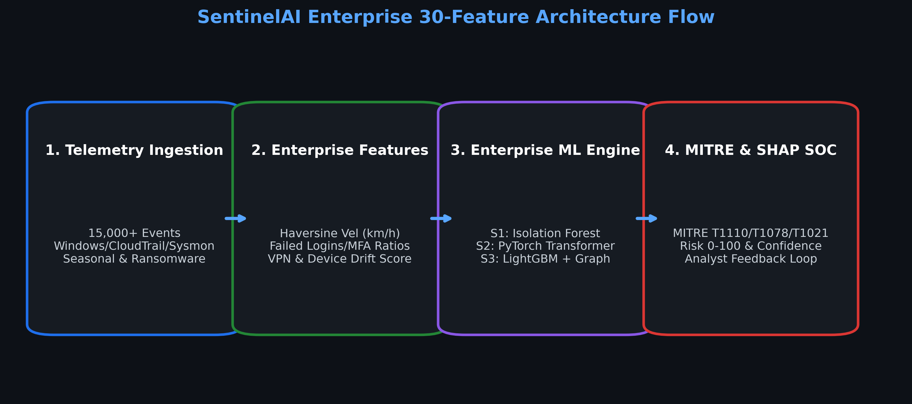

# SentinelAI: Cybersecurity Presentation Deck

> **Presentation File**: `SentinelAI_Cybersecurity_Presentation.pptx`  
> **PDF Export**: [SentinelAI_Cybersecurity_Presentation.pdf](file:///c:/Honeywell/SentinelAI_Cybersecurity_Presentation.pdf)  
> **Format**: SIH Idea Submission Standard Template Structure

---

## Slide 1: Important Instructions & Template Guidelines

* **Slide Limit**: Maximum 6 slides (excluding title page).
* **Format**: Points, diagrams, infographics, and pictures; minimal paragraph text.
* **Clarity**: Precise, concise, and easy to understand.
* **Idea Attributes**: Unique, novel, and production-ready implementation.

---

## Slide 2: TITLE PAGE

* **Problem Statement ID**: Cybersecurity Anomaly Detection & Threat Containment
* **Problem Statement Title**: AI-Powered Behavioral Anomaly Detection for Cybersecurity
* **Theme**: Cyber Security / Security Operations Center (SOC) Analytics
* **PS Category**: Software
* **Project Name**: SentinelAI — Cascaded Machine Learning & Telemetry Engine

---

## Slide 3: PROPOSED SOLUTION & INNOVATION

* **Idea Title**: SentinelAI — AI-Powered Cascaded Anomaly & Threat Detection Engine
* **Core Solution**: Sequence-aware ML engine detecting zero-day lateral movement, stolen credential abuse, brute force attacks, & ransomware activity.
* **Multi-Entity Telemetry Delineation**: Explicit operational delineation across **Users** (👤), **Service Accounts** (⚙️), and **Edge Devices** (🖥️).
* **Auth Method Tracking**: Monitors 4 distinct authentication protocols: **Password**, **Token** (OAuth/SAML/JWT), **Certificate** (mTLS), and **Biometric** (Passkey/FIDO2).
* **Explainability & MITRE Mapping**: Local SHAP feature attributions paired with MITRE ATT&CK technique IDs (`T1078`, `T1110`, `T1041`, `T1486`) for plain-English threat storytelling.
* **Active SOC Containment**: 1-click response buttons for session token revocation, credential reset, and network host endpoint isolation.

---

## Slide 4: TECHNICAL APPROACH & ARCHITECTURE

* **Core ML & Backend**: Python 3.12, FastAPI (REST & WebSockets), LightGBM Multi-Class Classifier, Isolation Forest, SHAP Explainability Engine.
* **Frontend SOC Dashboard**: React 18, Vite 5, Tailwind CSS, Lucide Icons, Recharts Analytics.
* **Feature Engineering Pipeline**: Extracts 30 spatiotemporal & sequence features including Haversine Velocity (km/h), cyclical time, and device drift score.
* **Cascaded 3-Stage Architecture**: Stage 1 Unsupervised Anomaly Scoring $\rightarrow$ Stage 2 Sequence Window $\rightarrow$ Stage 3 LightGBM Multi-Class Classifier.
* **Model Disk Caching**: Pre-trained models serialized with `joblib` for 0.06s instant server startup and sub-millisecond inference per log event.

### System Architecture Flow Diagram

---

## Slide 5: FEASIBILITY, VIABILITY & RISK MITIGATION

* **Feasibility & Performance**: 0.06s server launch time, ~1,200 events/sec throughput, and clean production Vite build (10.72s compile time).
* **Analyst Alert Budget**: Dynamic 97th percentile cutoff isolates top 1% critical threats, reducing analyst alert fatigue by 99%.
* **PSI Concept Drift Monitoring**: Tracks population stability index ($\text{PSI} = 0.0167$) to automatically detect data drift and maintain model accuracy.
* **Potential Challenges & Risks**: High-velocity telemetry bursts during DDoS/brute-force attacks and risk of false positives interrupting business workflows.
* **Mitigation Strategies**: Analyst Feedback Loop (`/api/feedback`) for online active learning + 1-click SOC false-positive dismissal.

---

## Slide 6: SYSTEM ARTIFACTS & LIVE DASHBOARD PROTOTYPE

* **Modular Codebase**: `backend/api_server.py` (FastAPI core), `backend/feature_engine.py`, `frontend/src/components/UserProcessDashboard.jsx`.
* **Live Dashboard Interfaces**: Executive Alert Feed & SHAP Panel + Multi-Entity Process Drilldown & 24-Hour Heatmap Matrix (Dark & Light Themes).
* **Automated Testing & Builds**: Clean Vite production bundle, sub-millisecond batch vector inference, and REST polling integration.

### Live Application Screenshots

#### 1. Executive Alert Feed & SHAP Panel (Dark Theme)

#### 2. Multi-Entity Process Drilldown & 24-Hour Heatmap Matrix (Dark Theme)

#### 3. Multi-Entity Process Drilldown Dashboard (Light Theme)

---

## Slide 7: RESEARCH, FRAMEWORKS & REFERENCES

* **MITRE ATT&CK Framework**: Mapped detection logic to `T1078` (Valid Accounts), `T1110` (Brute Force), `T1041` (Exfiltration Over C2), & `T1486` (Data Encrypted for Impact).
* **SHAP Explainability (Lundberg & Lee, 2017)**: *A Unified Approach to Interpreting Model Predictions* (NeurIPS 2017) for quantitative feature attributions.
* **Haversine Spatiotemporal Dynamics**: Great-Circle Distance calculation for high-velocity physical travel anomaly detection ($>800\text{ km/h}$).
* **LightGBM Engine (Ke et al., 2017)**: *LightGBM: A Highly Efficient Gradient Boosting Decision Tree* (Advances in Neural Information Processing Systems 30).
* **Project Documentation & Repository**: Complete technical documentation in `README.md` and PDF Guide (`AI_Powered_Behavioral_Anomaly_Detection_Comprehensive_Guide.pdf`).
